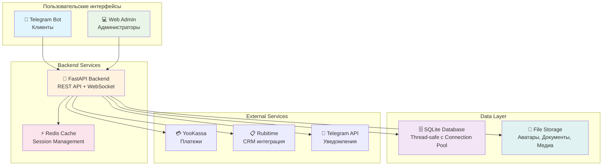

# 🏢 Coworking Management System

<div align="center">


**Профессиональная система управления коворкинг-пространством**

*Комплексное решение с Telegram-ботом, веб-админкой и аналитикой*

[🚀 Быстрый старт](#-быстрый-старт) • [📖 Документация](#-документация) • [⚡ Возможности](#-ключевые-возможности) • [🛡️ Безопасность](#️-безопасность)

</div>

---

## 🎯 О проекте

**Coworking Management System** — это enterprise-решение для автоматизации коворкинг-пространств, объединяющее **клиентский Telegram-бот**, **административную веб-панель** и **мощный REST API**. Система спроектирована с учетом современных требований к безопасности, производительности и масштабируемости.

### 🌟 Почему именно эта система?

- **🔧 Production-ready**: Готова к развертыванию в продакшене
- **🛡️ Enterprise Security**: JWT-аутентификация, система ролей, валидация данных
- **⚡ Высокая производительность**: Асинхронная архитектура, connection pooling, кэширование
- **📊 Богатая аналитика**: Детальные отчеты, графики, экспорт данных
- **🔄 Интеграции**: YooKassa, Telegram, Rubitime CRM
- **🎨 Современный UI**: React 18 + Chakra UI с адаптивным дизайном

---

## 🏗️ Архитектура

<div align="center">



</div>

---

## ⚡ Ключевые возможности

### 👥 Для клиентов (Telegram-бот)
- 🔐 **Регистрация** с реферальной системой и автоматическим созданием профилей
- 🎫 **Бронирование** рабочих мест с выбором тарифов и времени
- 💰 **Оплата** через YooKassa с поддержкой рассрочки и промокодов
- 🎯 **Промокоды** и система скидок с автоматическим применением
- 🆘 **Техподдержка** через тикетную систему с медиа-файлами
- 🔔 **Уведомления** о бронированиях, платежах и акциях

### 👨‍💼 Для администраторов (Веб-панель)
- 📊 **Аналитика** с интерактивными графиками и KPI
- 👤 **Управление пользователями** с детальными профилями и историей
- 📅 **Бронирования** с возможностью подтверждения/отмены
- 💸 **Финансовые отчеты** с экспортом в различные форматы
- 🎪 **Промокампании** и система лояльности
- 📮 **Массовые рассылки** с медиа-контентом и таргетингом
- 🛡️ **Система ролей** с 19+ детализированными разрешениями
- 🔧 **Техподдержка** с трекингом тикетов и файловыми вложениями

### 🔧 Системные возможности
- 📈 **Производительность**: Мониторинг медленных запросов, оптимизация БД
- 💾 **Кэширование**: Redis + thread-safe in-memory кэш
- 📋 **Логирование**: Структурированные логи с ротацией и Telegram-алертами
- 🔄 **Бэкапы**: Автоматическое резервное копирование с настраиваемой ротацией
- 🏥 **Health Checks**: Мониторинг состояния всех сервисов
- 📡 **API Keys**: Система для внешних интеграций

---

## 🛠️ Технологический стек

<div align="center">

| Категория | Технологии |
|-----------|------------|
| **Backend** |    |
| **Frontend** |    |
| **Database** |   |
| **DevOps** |   |
| **Integrations** |   |

</div>

---

## 🛡️ Безопасность

> **Оценка безопасности: 7.5/10 (ХОРОШО)** - Enterprise-ready с профессиональным подходом

### ✅ Реализованные меры защиты

- **🔐 Аутентификация**: JWT токены с проверкой срока действия
- **🛡️ Авторизация**: Детализированная система ролей и разрешений
- **🔒 Хеширование**: Пароли через PBKDF2:SHA256 с солью
- **🚫 SQL Injection**: Параметризованные запросы через SQLAlchemy
- **⚡ Rate Limiting**: Многоуровневая защита от злоупотреблений
- **📁 File Security**: Валидация типов файлов, защита от Path Traversal
- **🔧 Thread Safety**: Безопасные многопоточные операции
- **🗃️ Data Validation**: Комплексная валидация через Pydantic
- **🔍 Security Headers**: CORS, CSP, X-Frame-Options
- **📊 Audit Logging**: Отслеживание всех критических операций

### 🔍 Security Features

```python
# Пример защищенного эндпоинта
@router.get("/users")
async def get_users(
    current_admin: CachedAdmin = Depends(verify_token_with_permissions([
        Permission.VIEW_USERS, 
        Permission.MANAGE_USERS
    ]))
):
    # Автоматическая проверка прав доступа
    return await secure_user_query(current_admin)
```

---

## 🚀 Быстрый старт

### Предварительные требования
- 🐳 Docker & Docker Compose
- 🤖 Telegram Bot Token ([создать бота](https://t.me/BotFather))
- 💳 YooKassa аккаунт (опционально)

### 1️⃣ Установка

```bash
# Клонирование репозитория
git clone https://github.com/beerhunters/co-work_spa.git
cd coworking-system

# Создание конфигурации
cp .env.example .env
```

### 2️⃣ Конфигурация

Заполните `.env` файл:

```env
# 🔑 Обязательные параметры
BOT_TOKEN=your_telegram_bot_token_here
ADMIN_TELEGRAM_ID=your_admin_telegram_id
SECRET_KEY=your_super_secret_key_here
SECRET_KEY_JWT=your_jwt_secret_key_here
ADMIN_LOGIN=admin
ADMIN_PASSWORD=your_secure_password

# 🌐 Сетевые настройки
HOST=0.0.0.0
PORT=8000
FRONTEND_PORT=80
CORS_ORIGINS=http://localhost,http://127.0.0.1

# 💳 Платежная система (опционально)
YOKASSA_ACCOUNT_ID=your_yookassa_shop_id
YOKASSA_SECRET_KEY=your_yookassa_secret_key

# 📋 CRM интеграция (опционально)
RUBITIME_API_KEY=your_rubitime_api_key
RUBITIME_BRANCH_ID=12595
RUBITIME_COOPERATOR_ID=25786

# 📧 Email уведомления (опционально)
EMAIL_HOST=smtp.gmail.com
EMAIL_PORT=587
EMAIL_USER=your_email@gmail.com
EMAIL_PASSWORD=your_app_password
```

### 3️⃣ Запуск

```bash
# Запуск всех сервисов
docker-compose up -d

# Проверка статуса
docker-compose ps

# Просмотр логов
docker-compose logs -f web
```

### 4️⃣ Доступ к системе

- 🌐 **Веб-админка**: http://localhost
- 📊 **API Документация**: http://localhost:8000/docs
- 🤖 **Telegram Бот**: @your_bot_username

---

## 📖 Документация

### API Endpoints

После запуска системы документация доступна по адресам:
- **Swagger UI**: `http://localhost:8000/docs`
- **ReDoc**: `http://localhost:8000/redoc`

### Основные API маршруты

| Группа | Эндпоинт | Описание |
|--------|----------|----------|
| 🔐 Auth | `/auth/login` | Аутентификация админов |
| 👥 Users | `/users/` | Управление пользователями |
| 📅 Bookings | `/bookings/` | Бронирования |
| 💰 Payments | `/payments/` | Платежи |
| 🎫 Tickets | `/tickets/` | Техподдержка |
| 📊 Dashboard | `/dashboard/` | Аналитика |
| 🔧 Admin | `/admins/` | Управление админами |

---

## 📁 Структура проекта

```
coworking-system/
├── 🤖 bot/                     # Telegram бот
│   ├── handlers/              # Обработчики команд и сообщений
│   ├── keyboards/             # Клавиатуры и меню
│   ├── utils/                 # Утилиты бота
│   └── bot.py                 # Основной файл бота
│
├── 🌐 frontend/               # React веб-приложение
│   ├── public/               # Статические файлы
│   ├── src/
│   │   ├── components/       # React компоненты
│   │   ├── sections/         # Страницы админки
│   │   ├── utils/            # API клиент и утилиты
│   │   └── styles/           # Стили и темы
│   └── package.json
│
├── 🔧 routes/                 # FastAPI маршруты
│   ├── auth.py               # Аутентификация
│   ├── users.py              # Пользователи
│   ├── bookings.py           # Бронирования
│   ├── dashboard.py          # Аналитика
│   └── ...
│
├── 🗃️ models/                 # Модели базы данных
│   ├── models.py             # SQLAlchemy модели
│   └── database.py           # Подключение к БД
│
├── 📋 schemas/                # Pydantic схемы
├── 🛠️ utils/                  # Утилиты и хелперы
│   ├── logger.py             # Система логирования
│   ├── telegram_logger.py    # Telegram уведомления
│   ├── cache_manager.py      # Кэширование
│   └── file_utils.py         # Работа с файлами
│
├── 🐳 docker-compose.yml      # Docker конфигурация
├── 🐳 Dockerfile.web          # Backend образ
├── 🐳 Dockerfile.bot          # Bot образ
├── 🐳 Dockerfile.frontend     # Frontend образ
└── 📄 requirements.txt        # Python зависимости
```

---

## 🔧 Администрирование

### Мониторинг системы

```bash
# Просмотр статуса сервисов
docker-compose ps

# Мониторинг логов в реальном времени
docker-compose logs -f

# Проверка использования ресурсов
docker stats
```

### Управление данными

```bash
# Создание бэкапа БД
docker-compose exec web python -m utils.backup_manager

# Просмотр логов приложения
docker-compose exec web tail -f /app/logs/app.log

# Очистка кэша
docker-compose exec web python -c "
from utils.cache_manager import cache_manager
import asyncio
asyncio.run(cache_manager.clear_all())
"
```

### Обновление системы

```bash
# Получение обновлений
git pull origin main

# Пересборка образов
docker-compose build --no-cache

# Перезапуск с обновлениями
docker-compose down && docker-compose up -d
```

---

## 🎨 Скриншоты

<details>
<summary>🖼️ Показать интерфейсы системы</summary>

### 📊 Dashboard - Аналитика


### 👥 Управление пользователями


### 📅 Бронирования


### 🤖 Telegram Bot


</details>

---

## 🚀 Производительность

### Бенчмарки
- **API Response Time**: < 100ms для 95% запросов
- **Database Queries**: Оптимизированы для < 50ms
- **Memory Usage**: ~200MB в production
- **Concurrent Users**: Поддержка 1000+ одновременных пользователей

### Оптимизации
- ⚡ **Асинхронная архитектура** FastAPI
- 🔄 **Connection pooling** для БД
- 💾 **Многоуровневое кэширование** (Redis + in-memory)
- 📦 **Сжатие ответов** gzip
- 🗜️ **Минификация** статических файлов

---

## 🤝 Contributing

Проект находится в активной разработке. Для участия в разработке:

1. 🍴 Fork репозитория
2. 🔧 Создайте feature branch
3. ✅ Убедитесь, что тесты проходят
4. 📝 Создайте Pull Request

### Стандарты кода
- **Python**: PEP 8, type hints
- **JavaScript**: ESLint, Prettier
- **Git**: Conventional Commits

---

## 📄 Лицензия

**Proprietary License** - Все права защищены.

Данное программное обеспечение является собственностью разработчика и предназначено для демонстрационных целей.

---

## 📞 Поддержка

- 📧 **Email**: [dreadban@gmail.com](mailto:dreadban@gmail.com)
- 💬 **Telegram**: [@beerhunters](https://t.me/beerhunters)
- 🐛 **Issues**: [GitHub Issues](https://github.com/beerhunters/co-work_spa/issues)

---

<div align="center">

**⭐ Поставьте звезду если проект был полезен!**

Made with ❤️ by [Beerhunters](https://github.com/beerhunters)

</div>